# Procesverslag
Markdown is een simpele manier om HTML te schrijven.  
Markdown cheat cheet: [Hulp bij het schrijven van Markdown](https://github.com/adam-p/markdown-here/wiki/Markdown-Cheatsheet).

Nb. De standaardstructuur en de spartaanse opmaak van de README.md zijn helemaal prima. Het gaat om de inhoud van je procesverslag. Besteedt de tijd voor pracht en praal aan je website.

Nb. Door *open* toe te voegen aan een *details* element kun je deze standaard open zetten. Fijn om dat steeds voor de relevante stuk(ken) te doen.

## Jij

  
uitwerken voor kick-off werkgroep

  ### Auteur:
  Anouk Pebesma

  #### Je startniveau:
  Blauw

  #### Je focus:
  Surface plane
 

## Je website

  
uitwerken voor kick-off werkgroep

  ### Je opdracht:
  https://www.wizardingworld.com/ 

  #### Screenshot(s) van de eerste pagina (small screen): 
  Home pagina
  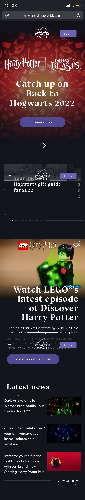

  #### Screenshot(s) van de tweede pagina (small screen):
  For kids pagina
  de for kids pagina heeft een andere link: https://www.startingharrypotter.com/?utm_source=wwd_web&utm_medium=nav&utm_campaign=shp-2022 
  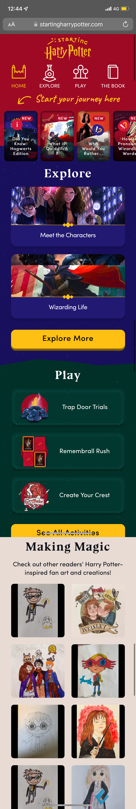
 

## Toegankelijkheidstest 1/2 (week 1)

  
uitwerken na test in 1e werkgroep

  ### Bevindingen
  Lijst met je bevindingen die in de test naar voren kwamen:

  #### Screenreader
  Hier korte omschrijving (met indien nodig afbeeldingen)
  - Gebruik je toetsenbord om je laptop te bedienen.
  - Begint met een tutorial over hoe de commando's werken.
  - De voice over praat heel snel en zonder pauzes.
  - Het start en stop geluidje lijkt veel op elkaar.
  - Speciale voice over toets, wordt alleen niet duidelijk gezegd wat je ermee moet.
  - Hij vertelt niet hoe je de browser opent, als je het weet hoe je het moet doen lukt het maar anders niet.
  - Hij leest de letters voor die je typt.

  Screenreader met de site:
  - Hij leest wel goed voor wat ieder linkje is en waar je heen gaat. Ook vertelt hij hoeveel onderdelen in de link zit.
  - Hij vertelt alles in de site in een poging. Geen pauzes, niks. 
  - De afbeeldingen leest hij voor als afbeelding. Word niet gezegd wat er op de afbeelding staat.

  Hier een omschrijving van hoe het opgelost kan worden (met indien nodig afbeeldingen)
  - Kijken of je pauzes kan inlassen na ieder stukje tekst / artikel.

  #### Muis en Toetsenbord 
  Hier korte omschrijving (met indien nodig afbeeldingen)
  - Tabt goed naar artikels.
  - Als je een artikel hebt gelezen en je denkt door te tabben naar je homepagina weer, moet je eerst langs alle browser buttons. Er is geen snelle terug naar home knop.
  - Je ziet de focus door een wit kader om de knop.

  Hier een omschrijving van hoe het opgelost kan worden (met indien nodig afbeeldingen)
  - Zowel een kader als de knop zelf een andere kleur maken voor de focus.
  - Onderaan een artikel een terug naar home pagina knop maken.

  #### Motoriek (shocks, elastiekjes)
  Hier korte omschrijving (met indien nodig afbeeldingen)
  - Met 1 hand is het moeilijk om overal bij te komen, je zou eerst je telefoon moeten neerleggen.
  - Typen is moeilijk.
  - Kleine knoppen mis je sneller.

  Hier een omschrijving van hoe het opgelost kan worden (met indien nodig afbeeldingen)
  - Grotere knoppen.

  #### Spasmes Parkinson
  Hier korte omschrijving (met indien nodig afbeeldingen)
  - Kleine letters is moeilijk te lezen.
  - Headings zijn leesbaar.
  - Scrollen werkt prima.
  - Knoppen drukken is moeilijk. Je mist of drukt per ongeluk op een knop.
  - Menu was moeilijk te bereiken.
  - Bij afbeeldingen zijn details minder zichtbaar.

  #### Concentratie (ballon)
  Hier korte omschrijving (met indien nodig afbeeldingen)
  - Plaatjes zijn goed te zien.
  - Snel je flow kwijt.
  - Tekst echt grondig lezen is niet te doen. 

  #### Visueel (brillen, contrast, kleurenblind, dark/light). 
  Hier korte omschrijving (met indien nodig afbeeldingen)
  
  Blurred vision
  - Kleine knoppen zie je moeilijker.
  - Kleine tekst is moeilijk te lezen.

  Protanopia
  - Het werkt prima, alleen je ziet alle kleuren wat anders.

  Deutoranopia
  -  Werkt prima, alles is leesbaar, je ziet alleen de kleuren wat anders.

  Tritanopia
  - Knoppen als login en learn more met en donkere achtergrond zijn goed te lezen, maar wanneer je het met een rode achtergrond hebt, is het vloekend.

  Achromatopsia
  - Geen kleur - werkt allemaal prima.

  Brillen:

  Contrafield loss
  - Telefoon in een bepaalde hoek houden want anders kun je het niet lezen.
  - Kleine letters zijn moeilijk te lezen.

  Low contrast
  - Contraste kleuren zijn een must.
  - Kleine letters kosten wat inspanning om te lezen.

  Hier een omschrijving van hoe het opgelost kan worden (met indien nodig afbeeldingen)

## Breakdownschets (week 1)

  
uitwerken na afloop 2e werkgroep

  ### de hele pagina: Home
  

  ### de hele pagina: For kids
  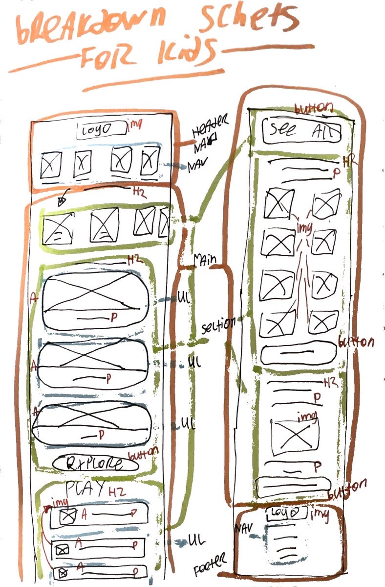
  

## Voortgang 1 (week 2)

  
uitwerken voor 1e voortgang

  ### Vragen
  1. Hoe maak ik gebruik van meerdere achtergrond foto's?
      Achtergrond foto's kan je invoegen met css. Dus je kan verschillende achtergrond foto's plaatsen, 1 in iedere sectie bijv.
  2. Als je voor surface plane hebt gekozen, moet de website dan ook nog responisve zijn?
      Ja en nee, alleen voor kleine en grote telefoons moet hij responsive zijn, niet responsive voor desktop.
  3. Hoe kan je ervoor zorgen dat je screenreader pauze's neemt en niet van de header tot aan de footer aan een stuk door alles zegt?
      Dit is een instelling in de instellingen van de screenreader, dit kan je dus niet aanpassen in de code.
  4. Hoe moet ik mijn CSS indelen, wat is het handigst?
      Begin met de generieke elementen voor beide pagina's, daarna begin je met de eerste pagina > sections, header, main, etc & daarna doe je hetzelfde
      voor de volgende pagina: sections, header, main, etc.

  
  
  ### Verdere punten vanuit het voortgangsgesprek.
  1. Een logo kan een H1 zijn, alt op het plaatje zetten op een H1, zodat de screenreader dit ziet.
  2. Als je ergens heen gaat is het een link, als je op dezelfde pagina gaat is het een button.
 
 
  
  ### Stand van zaken
  Dit is hoe mijn home pagina eruit zag tijdens het voortgangsgesprek:
  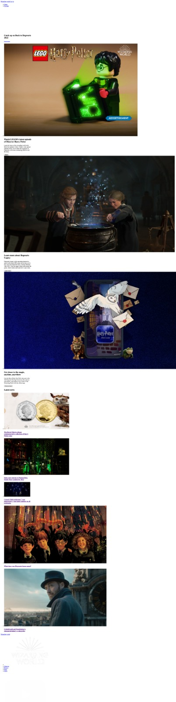

## Voortgang 2 (week 3)

  
uitwerken voor 2e voortgang

 
  ### Vragen
1. Hoe kan ik het best mijn css gebruiken met de 2e pagina? Er zullen namelijk veel selectoren al gebruikt zijn op de eerste pagina in een andere manier dan hoe ik ze zou moeten gebruiken op de tweede pagina.
  
  ### Stand van zaken
  hier dit ging goed & dit was lastig (neem ook screenshots op van delen van je website en code)
1. Voor een tijd heb ik geprutst met mijn slider, in hoe ik of de tekst kon laten stoppen met door elkaar lopen of hoe ik de plaatjes netjes op dezelfde rij kon zetten. Hieronder 2 plaatjes van mijn code:
  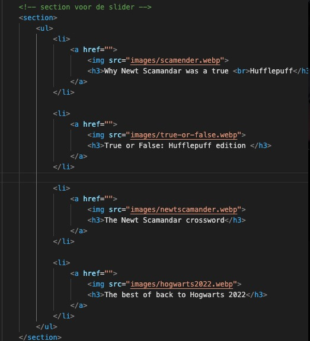
  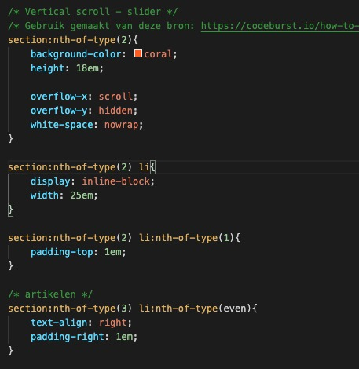
  
  Tot nu toe ziet zo de home pagina eruit:
  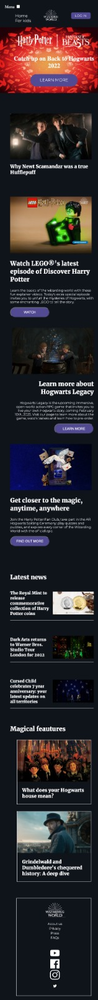

## Toegankelijkheidstest 2/2 (week 4)

  
uitwerken na test in 8e werkgroep

  ### Bevindingen
  Lijst met je bevindingen die in de test naar voren kwamen (geef ook aan wat er verbeterd is):
  1. Iphone 8 forkids is de achtergrond niet helemaal op het goede formaat.
  2. Home & forkids pagina is het kruisje png in de menu nog niet op github gezet.

  #### Screenreader
  1. Learn more knoppen zijn goed veranderd bij de home pagina, de forkids pagina moet nog.
    - Lean more knoppen kan ik nog kijken met een aria label.
  2. Er is een goede focus bij de knoppen, anderen zien waar je bent met je screen reader als je gebruikt.
  3. De snelheid van je screenreader kan je veranderen bij: toegankelijkheid > voice over > voice over programma > spraak >
     Snelheid. --> de gemiddelde snelheid is 45.
  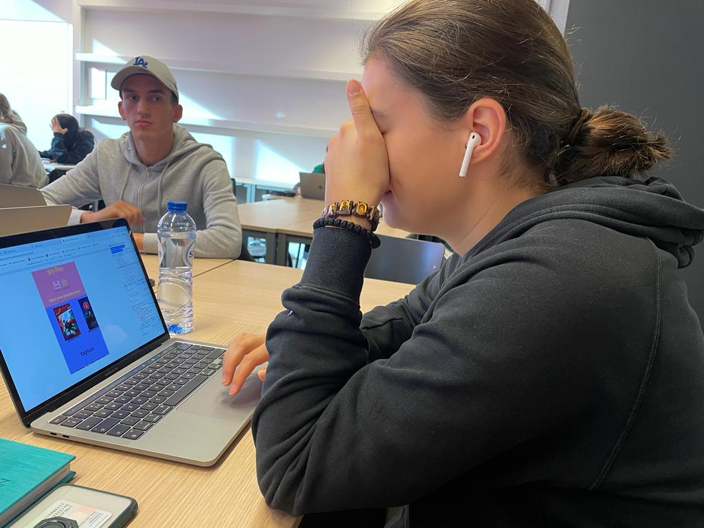

  #### Muis en Toetsenbord
  1. Met tabben zie je bij de homepagina niet welk artikel word geselecteerd bij de slider.
  2. Verder zie je duidelijk waar je bent.
  3. Er is een logische volgorde.
  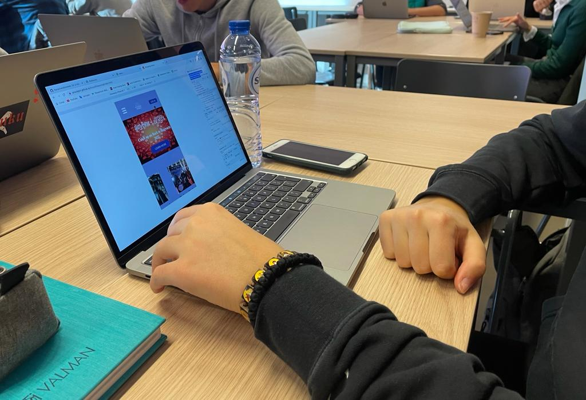

  #### Motoriek (shocks, elastiekjes)
  Met de elastiekjes lukte het goed om door de website heen te klikken.

  #### Visueel (brillen, contrast, kleurenblind, dark/light). 
  1. Met de hemifield loss bril leek er geen probleem te zijn.
  2. Met de combined loss bril kon de 
 wat groter, maar verder was alles goed.
  3. Met de color #0779p bril was alleen op de for kids pagina bij de slider een stukje tekst niet al te goed leesbaar.
  
  

## Voortgang 3 (week 4)

  
uitwerken voor 3e voortgang

  ### vragen 
  1. Wat houd toegankelijkheid ++ in?
  2. Wat is een praktische manier om je site naar github te zetten
  
  ### Stand van zaken
  hier dit ging goed & dit was lastig (neem ook screenshots op van delen van je website en code)
  1. Ik ben deze week veel bezig geweest om de site in css zo goed mogelijk na te maken. En dan ook beide pagina's css klaar te hebben. 
  2. Verder begonnen met de :root te veranderen in de pagina's en rekening te houden met color scheme preferances. 
  3. Ik heb een thema switch knop gemaakt.
  
  Tot nu toe ziet zo de home pagina eruit:
  
  Home pagina:
  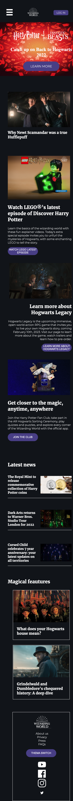

   Color scheme preferances:
  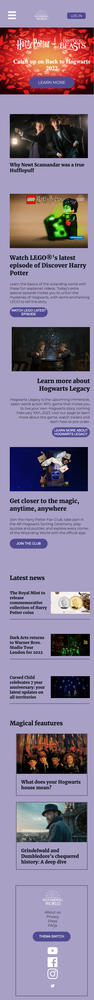
  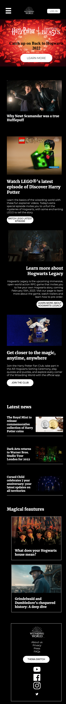
  

  For kids pagina:
  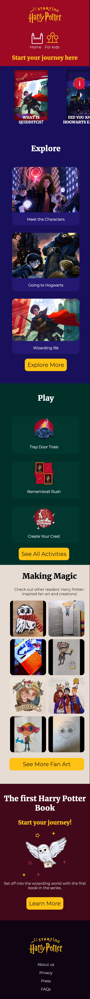

  Color scheme preferances:
  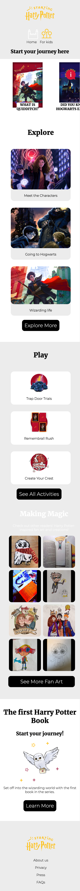
  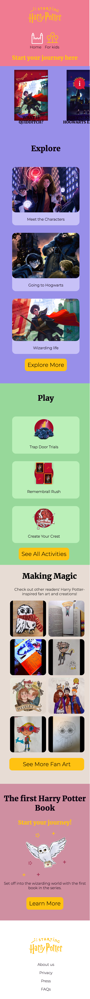
  

## Eindgesprek (week 5)

  
uitwerken voor eindgesprek

  ### 5 dingen van surface plane
  1. Dark / light mode
  Ik heb mijn laptop altijd op dark mode staan, dus ik ben ook begonnen met het designen van de dark mode. Ik heb gezien dat hij bij anderen begon met de light modus, maar dan ziet het er toch net wat anders uit.
  2. Custom theme
  Ik heb bij de home pagina aan de onderkant van de pagina een thema switch button staan. Als je hier op klikt veranderd het thema naar een kerst thema.
  3. Animatie toevoegen
  Ik heb bij de for kids pagina een animatie op het uil plaatje toegevoegd. 
  4. Geluid toevoegen
  Als je op de animatie drukt van nummer 3, dan speelt er een hogwarts liedje af.
  5. Toegankelijkheid ++
  - Op beide pagina's is er een meer contrast mode. 
  - Ik heb met een aria-label gewerkt bij de buttons zodat er geen leer meer of bekijk knoppen zijn. 
  - Op de animatie is er een reduced motion modes, voor als je ziek word van het constante gedraai van de uil. Hij zal dan stoppen met draaien.

  ### Je uitkomst - karakteristiek screenshots:
  Home pagina:

  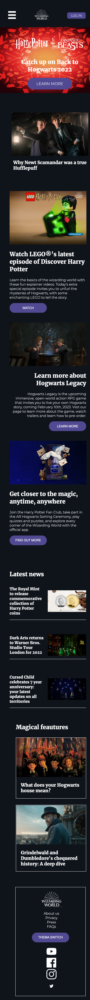
  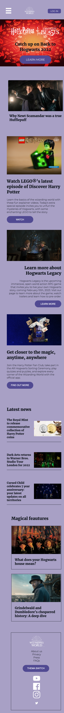
  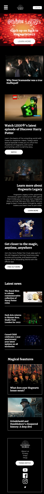

  For kids pagina:

  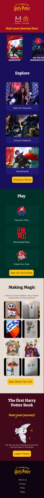
  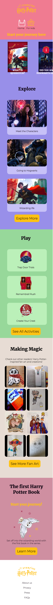
  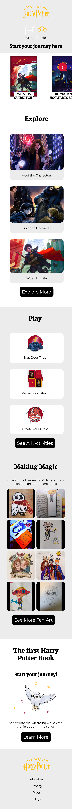

  ### Dit ging goed/Heb ik geleerd: 
  Ik heb geleerd hoe :root werkt en hoe ik hiermee met weinig moeite toch dingen zoals een thema switcher kan maken of rekening kan houden met ligt en dark mode of contrast.

  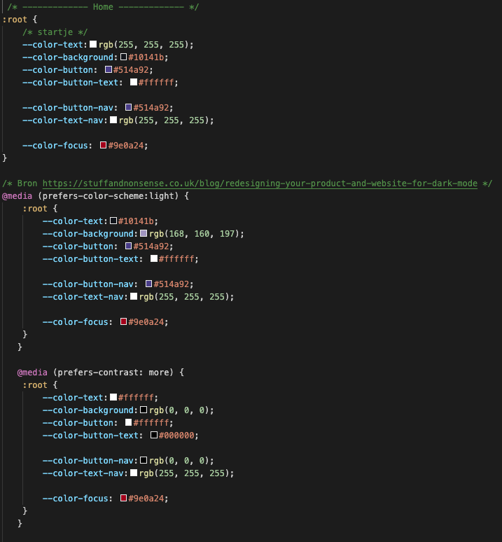
  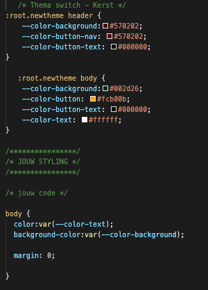
  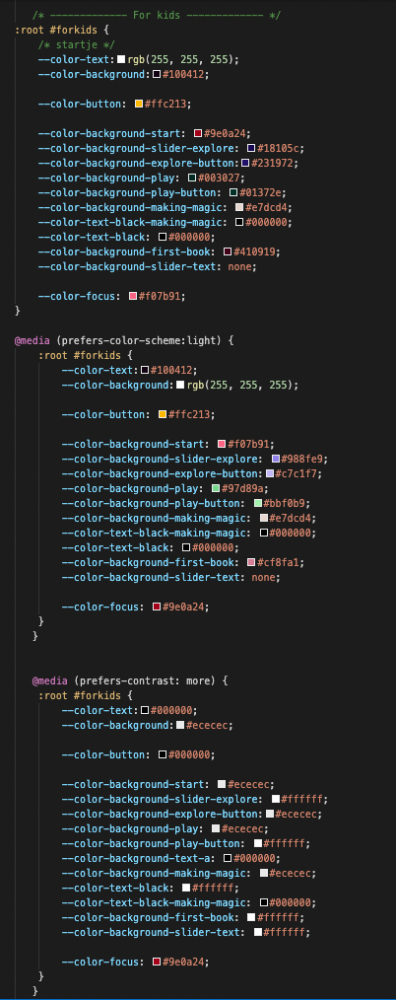

  Ik heb geleerd hoe aria-labels werken en dat je ze zowel op buttons als linkjes kan zetten.

  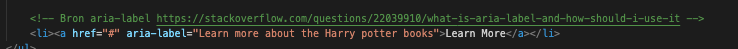

  ### Dit was lastig/Is niet gelukt:

  Toen ik de site eindelijk af had, wou ik hem naar Github updaten. Nou kreeg ik een error die ik hiervoor nooit eerder heb gehad. Er was iets mis met de deploy? Ik heb een aantal keer alle mapjes en bestanden geprobeerd opnieuw up te loaden. Dit leek niet te lukken. Ik heb aan mijn klasgenoten gevraagd of zij het antwoord wisten, toen zij het niet wisten heb ik het gevraagd aan de klassen assistenten. Zij hebben niet optijd gereageerd.

  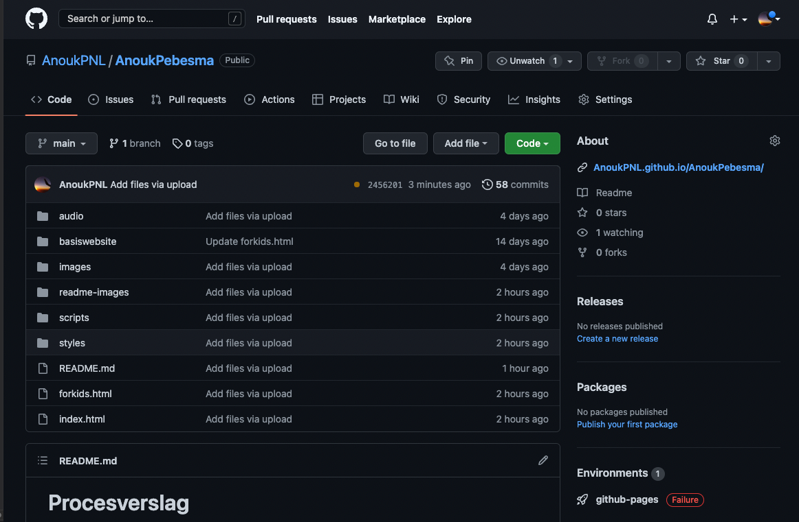
  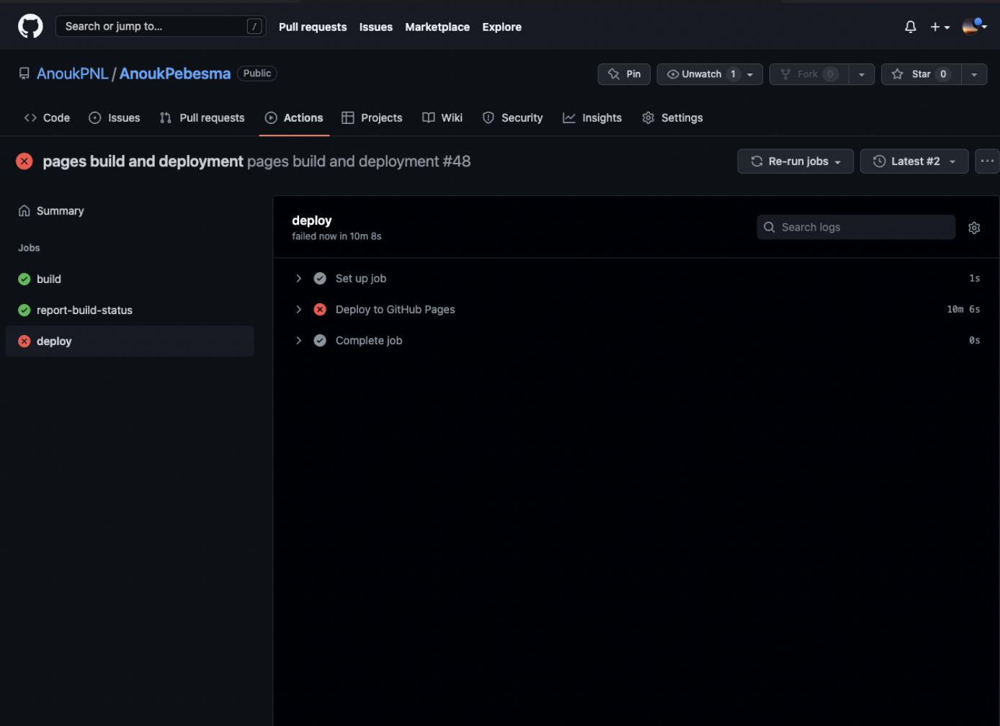

## Bronnenlijst

  
continu bijhouden terwijl je werkt

  Nb. Wees specifiek ('css-tricks' als bron is bijv. niet specifiek genoeg).

  1. Padding van sticky menu - bron: https://www.w3schools.com/howto/howto_js_navbar_sticky.asp
  2. Background positioning - bron: https://developer.mozilla.org/en-US/docs/Web/CSS/background-position-x
  3. Background images - bron: https://developer.mozilla.org/en-US/docs/Web/CSS/CSS_Backgrounds_and_Borders/Resizing_background_images
  4. Vertical scroll slider - bron: https://codeburst.io/how-to-create-horizontal-scrolling-containers-d8069651e9c6
  5. Animatie op image - bron: https://imagekit.io/blog/creating-css-image-effects/
  6. Prefers reduced motion - bron: https://developer.mozilla.org/en-US/docs/Web/CSS/@media/prefers-reduced-motion 
  7. Aria-label hoe werkt het? - bron: https://stackoverflow.com/questions/22039910/what-is-aria-label-and-how-should-i-use-it
  8. Dark & light scheme - bron: https://stuffandnonsense.co.uk/blog/redesigning-your-product-and-website-for-dark-mode
  9. Voor het positioneren van elementen op de webite - bron: https://css-tricks.com/snippets/css/a-guide-to-flexbox/
  10. Audio invoegen - bron: https://www.sitepoint.com/community/t/play-sound-on-hover-or-click-diffferent-audio-for-different-images/99391
  

