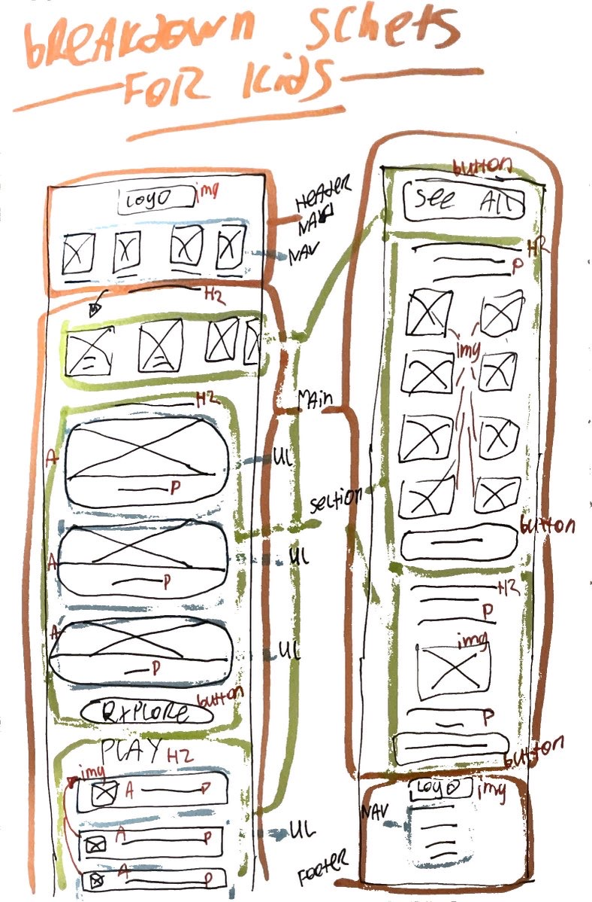

# Procesverslag
Markdown is een simpele manier om HTML te schrijven.  
Markdown cheat cheet: [Hulp bij het schrijven van Markdown](https://github.com/adam-p/markdown-here/wiki/Markdown-Cheatsheet).

Nb. De standaardstructuur en de spartaanse opmaak van de README.md zijn helemaal prima. Het gaat om de inhoud van je procesverslag. Besteedt de tijd voor pracht en praal aan je website.

Nb. Door *open* toe te voegen aan een *details* element kun je deze standaard open zetten. Fijn om dat steeds voor de relevante stuk(ken) te doen.

## Jij

  
uitwerken voor kick-off werkgroep

  ### Auteur:
  Anouk Pebesma

  #### Je startniveau:
  Blauw

  #### Je focus:
  Surface plane
 

## Je website

  
uitwerken voor kick-off werkgroep

  ### Je opdracht:
  https://www.wizardingworld.com/ 

  #### Screenshot(s) van de eerste pagina (small screen): 
  Home pagina
  

  #### Screenshot(s) van de tweede pagina (small screen):
  For kids pagina
  de for kids pagina heeft een andere link: https://www.startingharrypotter.com/?utm_source=wwd_web&utm_medium=nav&utm_campaign=shp-2022 
  
 

## Toegankelijkheidstest 1/2 (week 1)

  
uitwerken na test in 1e werkgroep

  ### Bevindingen
  Lijst met je bevindingen die in de test naar voren kwamen:

  #### Screenreader
  Hier korte omschrijving (met indien nodig afbeeldingen)
  - Gebruik je toetsenbord om je laptop te bedienen.
  - Begint met een tutorial over hoe de commando's werken.
  - De voice over praat heel snel en zonder pauzes.
  - Het start en stop geluidje lijkt veel op elkaar.
  - Speciale voice over toets, wordt alleen niet duidelijk gezegd wat je ermee moet.
  - Hij vertelt niet hoe je de browser opent, als je het weet hoe je het moet doen lukt het maar anders niet.
  - Hij leest de letters voor die je typt.

  Screenreader met de site:
  - Hij leest wel goed voor wat ieder linkje is en waar je heen gaat. Ook vertelt hij hoeveel onderdelen in de link zit.
  - Hij vertelt alles in de site in een poging. Geen pauzes, niks. 
  - De afbeeldingen leest hij voor als afbeelding. Word niet gezegd wat er op de afbeelding staat.

  Hier een omschrijving van hoe het opgelost kan worden (met indien nodig afbeeldingen)
  - Kijken of je pauzes kan inlassen na ieder stukje tekst / artikel.

  #### Muis en Toetsenbord 
  Hier korte omschrijving (met indien nodig afbeeldingen)
  - Tabt goed naar artikels.
  - Als je een artikel hebt gelezen en je denkt door te tabben naar je homepagina weer, moet je eerst langs alle browser buttons. Er is geen snelle terug naar home knop.
  - Je ziet de focus door een wit kader om de knop.

  Hier een omschrijving van hoe het opgelost kan worden (met indien nodig afbeeldingen)
  - Zowel een kader als de knop zelf een andere kleur maken voor de focus.
  - Onderaan een artikel een terug naar home pagina knop maken.

  #### Motoriek (shocks, elastiekjes)
  Hier korte omschrijving (met indien nodig afbeeldingen)
  - Met 1 hand is het moeilijk om overal bij te komen, je zou eerst je telefoon moeten neerleggen.
  - Typen is moeilijk.
  - Kleine knoppen mis je sneller.

  Hier een omschrijving van hoe het opgelost kan worden (met indien nodig afbeeldingen)
  - Grotere knoppen.

  #### Spasmes Parkinson
  Hier korte omschrijving (met indien nodig afbeeldingen)
  - Kleine letters is moeilijk te lezen.
  - Headings zijn leesbaar.
  - Scrollen werkt prima.
  - Knoppen drukken is moeilijk. Je mist of drukt per ongeluk op een knop.
  - Menu was moeilijk te bereiken.
  - Bij afbeeldingen zijn details minder zichtbaar.

  #### Concentratie (ballon)
  Hier korte omschrijving (met indien nodig afbeeldingen)
  - Plaatjes zijn goed te zien.
  - Snel je flow kwijt.
  - Tekst echt grondig lezen is niet te doen. 

  #### Visueel (brillen, contrast, kleurenblind, dark/light). 
  Hier korte omschrijving (met indien nodig afbeeldingen)
  
  Blurred vision
  - Kleine knoppen zie je moeilijker.
  - Kleine tekst is moeilijk te lezen.

  Protanopia
  - Het werkt prima, alleen je ziet alle kleuren wat anders.

  Deutoranopia
  -  Werkt prima, alles is leesbaar, je ziet alleen de kleuren wat anders.

  Tritanopia
  - Knoppen als login en learn more met en donkere achtergrond zijn goed te lezen, maar wanneer je het met een rode achtergrond hebt, is het vloekend.

  Achromatopsia
  - Geen kleur - werkt allemaal prima.

  Brillen:

  Contrafield loss
  - Telefoon in een bepaalde hoek houden want anders kun je het niet lezen.
  - Kleine letters zijn moeilijk te lezen.

  Low contrast
  - Contraste kleuren zijn een must.
  - Kleine letters kosten wat inspanning om te lezen.

  Hier een omschrijving van hoe het opgelost kan worden (met indien nodig afbeeldingen)

## Breakdownschets (week 1)

  
uitwerken na afloop 2e werkgroep

  ### de hele pagina: Home
  

  ### de hele pagina: For kids
  
  

## Voortgang 1 (week 2)

  
uitwerken voor 1e voortgang

  ### Vragen
  1. Hoe maak ik gebruik van meerdere achtergrond foto's?
      Achtergrond foto's kan je invoegen met css. Dus je kan verschillende achtergrond foto's plaatsen, 1 in iedere sectie bijv.
  2. Als je voor surface plane hebt gekozen, moet de website dan ook nog responisve zijn?
      Ja en nee, alleen voor kleine en grote telefoons moet hij responsive zijn, niet responsive voor desktop.
  3. Hoe kan je ervoor zorgen dat je screenreader pauze's neemt en niet van de header tot aan de footer aan een stuk door alles zegt?
      Dit is een instelling in de instellingen van de screenreader, dit kan je dus niet aanpassen in de code.
  4. Hoe moet ik mijn CSS indelen, wat is het handigst?
      Begin met de generieke elementen voor beide pagina's, daarna begin je met de eerste pagina > sections, header, main, etc & daarna doe je hetzelfde
      voor de volgende pagina: sections, header, main, etc.

  
  
  ### Verdere punten vanuit het voortgangsgesprek.
  1. Een logo kan een H1 zijn, alt op het plaatje zetten op een H1, zodat de screenreader dit ziet.
  2. Als je ergens heen gaat is het een link, als je op dezelfde pagina gaat is het een button.
 
 
  
  ### Stand van zaken
  Dit is hoe mijn home pagina eruit zag tijdens het voortgangsgesprek:
  

## Voortgang 2 (week 3)

  
uitwerken voor 2e voortgang

  ### Stand van zaken
  hier dit ging goed & dit was lastig (neem ook screenshots op van delen van je website en code)

  ### Agenda voor meeting
  samen met je groepje opstellen

  | student 1      | student 2          | student 3    | student 4        |
  | ---            | ---                | ---          | ---              |
  | dit bespreken  | en dit             | en ik dit    | en dan ik dat    |
  | en dat ook nog | dit als er tijd is | nog een punt | dit wil ik zeker |
  | ...            | ...                | ...          | ...              |

  ### Verslag van meeting
  hier na afloop snel de uitkomsten van de meeting vastleggen

  - punt 1
  - punt 2
  - nog een punt
- ...

## Toegankelijkheidstest 2/2 (week 4)

  
uitwerken na test in 8e werkgroep

  ### Bevindingen
  Lijst met je bevindingen die in de test naar voren kwamen (geef ook aan wat er verbeterd is):

  #### Screenreader
  Hier korte omschrijving (met indien nodig afbeeldingen)

  Hier een omschrijving van hoe het opgelost kan worden (met indien nodig afbeeldingen)

  #### Muis en Toetsenbord 
  Hier korte omschrijving (met indien nodig afbeeldingen)

  Hier een omschrijving van hoe het opgelost kan worden (met indien nodig afbeeldingen)

  #### Motoriek (shocks, elastiekjes)
  Hier korte omschrijving (met indien nodig afbeeldingen)

  Hier een omschrijving van hoe het opgelost kan worden (met indien nodig afbeeldingen)

  #### Visueel (brillen, contrast, kleurenblind, dark/light). 
  Hier korte omschrijving (met indien nodig afbeeldingen)

  Hier een omschrijving van hoe het opgelost kan worden (met indien nodig afbeeldingen)

## Voortgang 3 (week 4)

  
uitwerken voor 3e voortgang

  ### Stand van zaken
  hier dit ging goed & dit was lastig (neem ook screenshots op van delen van je website en code)

  ### Agenda voor meeting
  samen met je groepje opstellen

  | student 1      | student 2          | student 3    | student 4        |
  | ---            | ---                | ---          | ---              |
  | dit bespreken  | en dit             | en ik dit    | en dan ik dat    |
  | en dat ook nog | dit als er tijd is | nog een punt | dit wil ik zeker |
  | ...            | ...                | ...          | ...              |

  ### Verslag van meeting
  hier na afloop snel de uitkomsten van de meeting vastleggen

  - punt 1
  - punt 2
  - nog een punt
  - ...

## Eindgesprek (week 5)

  
uitwerken voor eindgesprek

  ### Je uitkomst - karakteristiek screenshots:
  

  ### Dit ging goed/Heb ik geleerd: 
  Korte omschrijving met plaatjes

  

  ### Dit was lastig/Is niet gelukt:
  Korte omschrijving met plaatjes

  

## Bronnenlijst

  
continu bijhouden terwijl je werkt

  Nb. Wees specifiek ('css-tricks' als bron is bijv. niet specifiek genoeg).

  1. bron 1
  2. bron 2
  3. ...

